<div align="center">

  <h1 style="margin-bottom: 0;">OpenGPT</h1>
  <p style="margin-top: 4px;">Experiment with open-source AI models</p>

[](https://nextjs.org/) [](https://reactjs.org/) [](https://www.typescriptlang.org/) [](https://workers.cloudflare.com/) [](https://sdk.vercel.ai/) [](https://tailwindcss.com/) [](LICENSE)

<br />

A modern AI playground that combines the **development experience of Next.js** with the **performance of Cloudflare Workers**. Experiment with 50+ open-source AI models, including GPT-OSS, Leonardo, Llama, Qwen, Gemini, and more.

</div>

## **Why OpenGPT?**

<div align="center">

### 🏆 **Best of Both Worlds**

**Development Experience** 💻 + **Deployment Performance** ⚡

</div>

OpenGPT leverages three core technologies to deliver an exceptional AI development experience:

### 🔧 **Core Technologies**

| Technology                   | What it brings                                   | Why it matters                                                              |
| ---------------------------- | ------------------------------------------------ | --------------------------------------------------------------------------- |
| **🔗 OpenNext**              | Seamless Next.js → Cloudflare Workers deployment | Deploy Next.js apps globally with the most affordable edge compute offering |
| **🤖 AI SDK v5**             | Universal AI framework with streaming support    | Connect to any AI provider with type-safe, streaming APIs                   |
| **☁️ Cloudflare Workers AI** | Global AI inference                              | Sub-100ms latency worldwide with 50+ open-source models                     |

## 🌟 **Features**

### 💬 **Dual-Mode AI Interface**

- **Chat Mode**: Conversational AI with 50+ text generation models
- **Image Mode**: High-quality image generation with 5+ image models
- **Seamless Switching**: Toggle between modes without losing context

### 🧠 **Advanced Reasoning Support**

- **Thinking Process Visualization**: See how AI models reason through problems
- **Collapsible Reasoning**: Clean UI that shows/hides reasoning on demand
- **Universal Compatibility**: Works with any AI model that supports reasoning tokens

### 🎨 **Modern User Experience**

- **AI Elements UI**: Professional, accessible components built using [AI Elements](https://ai-sdk.dev/elements/overview)
- **Responsive Design**: Mobile-first with smooth interactions
- **Real-time Streaming**: See responses as they're generated

### 🔧 **Developer Experience**

- **Type Safety**: Full TypeScript with Cloudflare bindings
- **One-Command Deploy**: `pnpm deploy` to Cloudflare Workers globally

## 🚀 **Getting Started**

### Installation

```bash

# Clone the repository
git clone https://github.com/devhims/opengpt.git
cd opengpt

# Install dependencies
pnpm install

# Start development server
pnpm dev
```

Visit [http://localhost:3000](http://localhost:3000) to see OpenGPT in action! 🎉

### Environment Setup

1. **Create `.dev.vars`** for local development:

```bash
# .dev.vars (not committed to git)
NEXTJS_ENV=development
```

2. **For production secrets**:

```bash
wrangler secret put NEXTJS_ENV
```

## 🛠️ **Available Scripts**

| Command           | Description                                     |
| ----------------- | ----------------------------------------------- |
| `pnpm dev`        | Start development server with Turbopack         |
| `pnpm build`      | Build the Next.js application                   |
| `pnpm preview`    | Preview the Cloudflare Workers build locally    |
| `pnpm deploy`     | Build and deploy to Cloudflare Workers globally |
| `pnpm lint`       | Run ESLint with TypeScript rules                |
| `pnpm format`     | Format code with Prettier                       |
| `pnpm cf-typegen` | Generate Cloudflare binding types               |

## 🤖 **Supported AI Models**

### Text Generation (50+ Models)

- **GPT-OSS**: OpenAI-compatible 20B and 120B variants
- **Meta Llama**: 4 Scout 17B, 3.3 70B, 3.1 family (6 variants), 3.2 family (3 variants), 3.0 family (3 variants)
- **Google Gemma**: 3 12B IT, 7B IT, and LoRA variants (4 total)
- **Mistral**: Small 3.1 24B, 7B v0.1/v0.2 variants (5 total)
- **Qwen**: QWQ 32B, 2.5 Coder 32B, and 1.5 family variants (6 total)
- **DeepSeek**: R1 Distill Qwen 32B, Math 7B, Coder variants (4 total)
- **Other Models**: Falcon, Phi-2, TinyLlama, SQLCoder, and 10+ specialized models

### Image Generation (5+ Models)

- **Black Forest Labs**: FLUX-1-Schnell (fast, high-quality text-to-image)
- **Leonardo AI**: Lucid Origin and Phoenix 1.0
- **Stability AI**: Stable Diffusion XL Base 1.0
- **ByteDance**: Stable Diffusion XL Lightning (ultra-fast generation)

## 🏗️ **Architecture**

OpenGPT showcases a modern, production-ready architecture with comprehensive request handling:

```mermaid
flowchart TD
    User[👤 User] --> UI[🎨 Next.js Frontend]
    UI --> ModeToggle{Mode Selection}

    ModeToggle -->|💬 Chat| ChatPath[Chat Request Path]
    ModeToggle -->|🖼️ Image| ImagePath[Image Request Path]

    ChatPath --> ChatAPI[📡 /api/chat]
    ImagePath --> ImageAPI[📡 /api/image]

    ChatAPI --> RateLimit1[🚫 Rate Limiter]
    ImageAPI --> RateLimit2[🚫 Rate Limiter]

    RateLimit1 --> RateCheck1{Rate OK?}
    RateLimit2 --> RateCheck2{Rate OK?}

    RateCheck1 -->|❌| RateError1[429 Error]
    RateCheck1 -->|✅| ChatProcessing[🤖 Chat Processing]

    RateCheck2 -->|❌| RateError2[429 Error]
    RateCheck2 -->|✅| ImageProcessing[🎨 Image Processing]

    ChatProcessing --> ModelType{Model Type}
    ModelType -->|Standard| Streaming[🌊 Real-time Streaming]
    ModelType -->|GPT-OSS| Batch[📋 Batch Processing]

    ImageProcessing --> ImageAI[🎨 Cloudflare AI]
    ImageAI --> ImageResponse[📸 Generated Image]

    Streaming --> ParseReasoning[🧠 Parse Reasoning]
    Batch --> ParseReasoning

    ParseReasoning --> ChatSuccess[✅ Chat Response]
    ImageResponse --> ImageSuccess[✅ Image Response]

    RateError1 --> ErrorUI[🎨 Error Display]
    RateError2 --> ErrorUI

    ChatSuccess --> ResponseUI[📥 Response Display]
    ImageSuccess --> ResponseUI
```



### Key Architectural Decisions

- **🔗 OpenNext**: Seamless Next.js to Cloudflare Workers deployment with global edge distribution
- **🤖 AI SDK v5**: Type-safe, streaming AI interactions with reasoning token support
- **🧠 Reasoning Tokens**: Enhanced AI thinking process visualization with collapsible UI
- **🚫 Rate Limiting**: Hybrid Upstash Redis + Cloudflare KV approach with IP-based daily limits
- **⚡ Dual-Mode Processing**: Separate optimized pathways for chat vs image generation

### Request Processing Flow

1. **Frontend Validation**: Client-side input validation and optional rate limit pre-checking
2. **Rate Limiting**: IP-based daily limits (20 chat, 5 image requests) with Redis/KV storage
3. **Model Routing**: Smart routing between Standard Models (streaming) and GPT-OSS Models (batch)
4. **AI Processing**: Direct Cloudflare Workers AI integration with optimized parameters
5. **Response Handling**: Reasoning token parsing, format conversion, and UI display

## 🚀 **Deployment**

```bash
# Build and deploy in one command
pnpm deploy

# Or step by step
pnpm build
npx wrangler deploy
```

### Environment Variables

| Variable                   | Description                    |
| -------------------------- | ------------------------------ |
| `UPSTASH_REDIS_REST_URL`   | Upstash Redis URL (optional)   |
| `UPSTASH_REDIS_REST_TOKEN` | Upstash Redis token (optional) |

### Adding New Models

1. **Add model to constants**:

```typescript
// src/constants/index.ts
export const CLOUDFLARE_AI_MODELS = {
  textGeneration: [
    // Add your new model here
    '@cf/vendor/new-model',
    // ... existing models
  ] as const,
  imageGeneration: [
    // For image models
  ] as const,
};
```

2. **Update utility functions**:

```typescript
// src/constants/index.ts
export function getTextGenerationModels(): readonly string[] {
  return CLOUDFLARE_AI_MODELS.textGeneration;
}
```

3. **Test the integration**:

```bash
pnpm dev
# Test the new model in the UI
```

## 🤝 **Contributing**

We welcome contributions!

### Quick Start for Contributors

```bash
# Fork the repo and clone your fork
git clone https://github.com/devhims/opengpt.git

# Create a feature branch
git checkout -b feature/new-feature

# Make your changes and test
pnpm dev

# Run linting and formatting
pnpm lint
pnpm format

# Commit using conventional commits
git commit -m "feat: add new feature"

# Push and create a PR
git push origin feature/new-feature
```

### Code Style

- **TypeScript**: Strict mode enabled
- **Formatting**: Prettier with Tailwind class sorting
- **Linting**: ESLint with Next.js rules

## 📄 **License**

This project is licensed under the MIT License.

<div align="center">

**Made with ❤️ for the AI community**

⭐ **Star this repo** if you find it useful!

</div>
